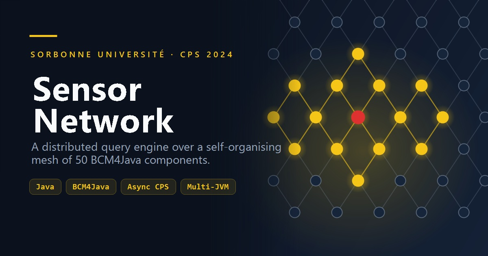
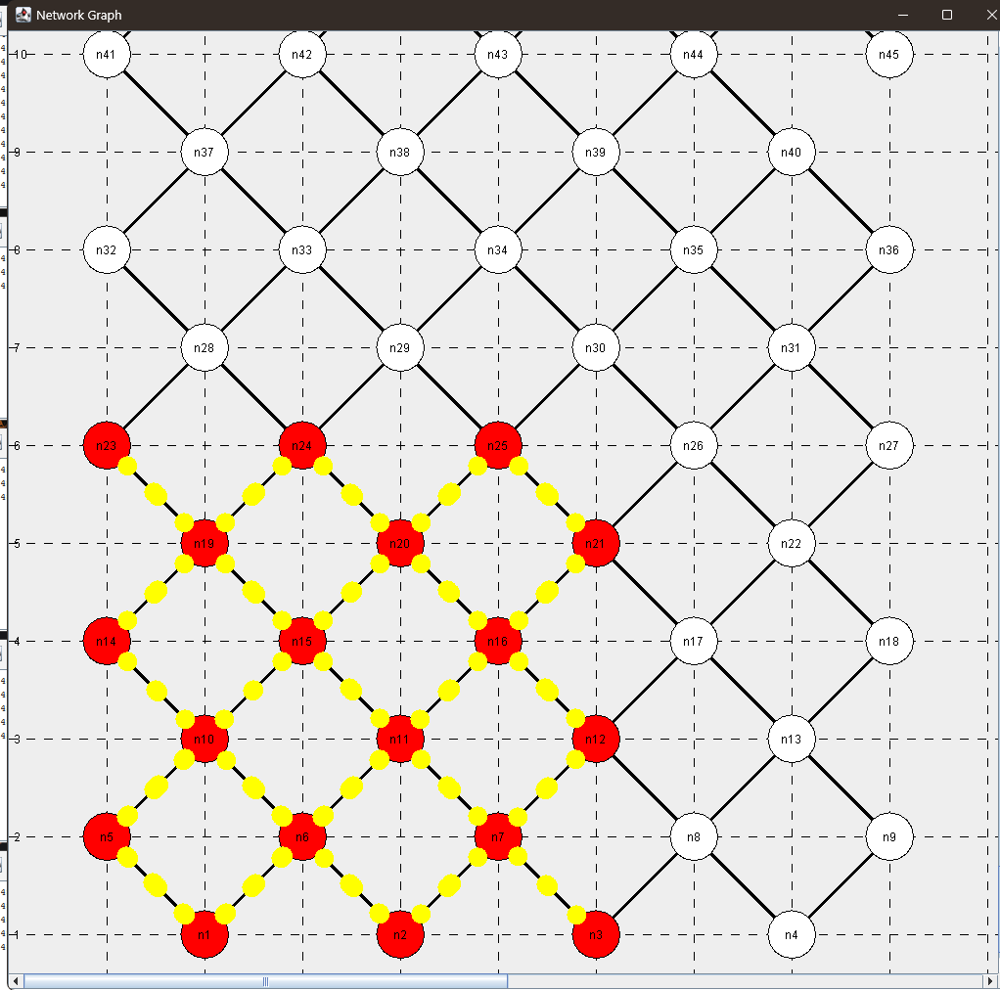
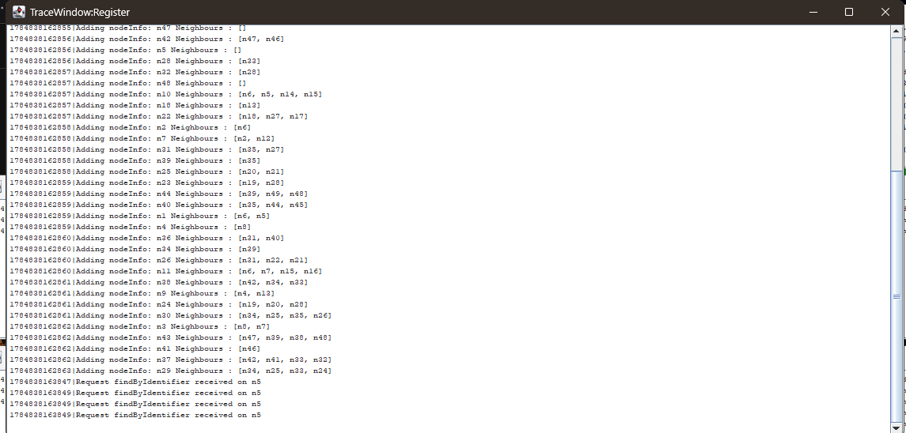
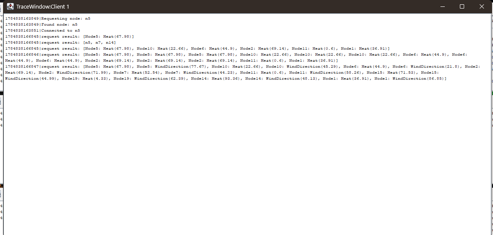
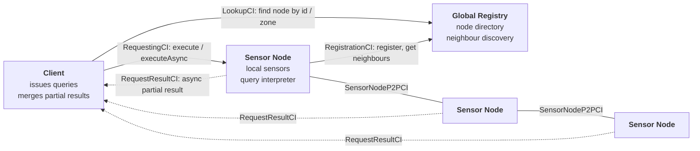
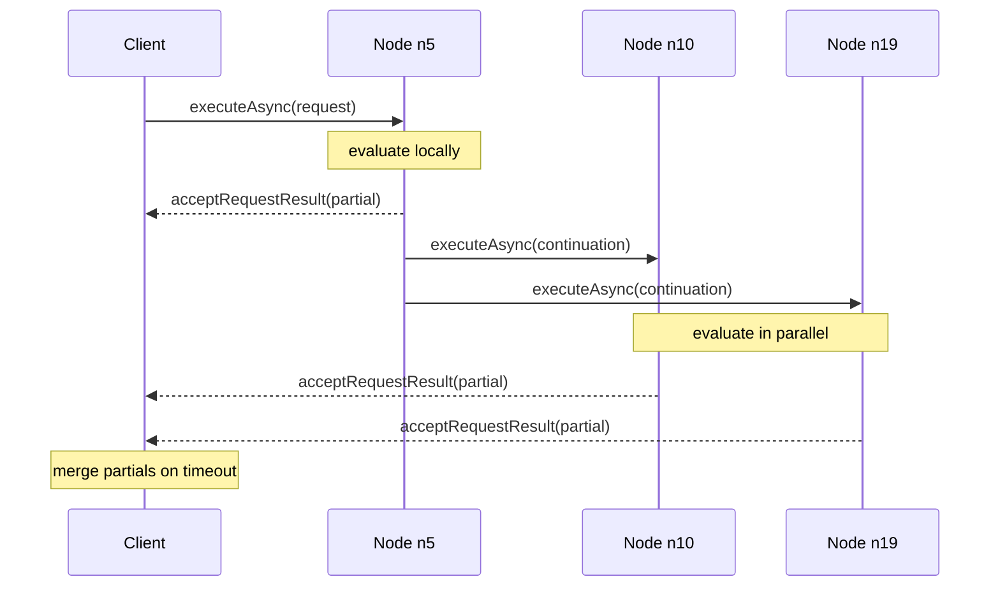

<p align="center">
  
</p>

<p align="center">
  
  
  
  
</p>

# Sensor Network

A distributed sensor-network monitoring system built on **BCM4Java**, the component model taught in the CPS course at Sorbonne Université. Fifty sensor nodes discover each other through a registry, form a geographic mesh, and cooperatively evaluate queries written in a small custom language — each node interpreting the query against its own sensors and forwarding a *continuation* to the neighbours the query still needs to reach.

The interesting part is not the sensors; it is that **no node has a global view**. A query enters the mesh at one node and the result assembles itself out of partial answers flowing back through the topology.

---

## Quick start

You need a **JDK 8 or later** on your `PATH` and nothing else — every dependency is vendored in `deployment/jars/`. No Maven, no Gradle, no Eclipse.

```bash
git clone https://github.com/Tinshea/Sensor_Network.git
cd Sensor_Network
```

**Linux / macOS**
```bash
chmod +x run.sh
./run.sh              # compile + run the mono-JVM scenario
./run.sh --tests      # compile + run the JUnit 5 suite
```

**Windows (PowerShell)**
```powershell
.\run.ps1             # compile + run the mono-JVM scenario
.\run.ps1 -Tests      # compile + run the JUnit 5 suite
```

The scenario runs for about 30 seconds and then shuts itself down. It opens a **Network Graph** window plus one trace console per component (~55 windows — this is BCM4Java's normal debugging behaviour). Results also land in `client.log`, `node.log` and `Register.log`.

| Flag | Effect |
|---|---|
| `--tests` / `-Tests` | Build and run the 79 unit tests instead of the simulation |
| `--main <class>` / `-Main <class>` | Run a different entry point (e.g. `app.DistributedCVM`) |
| `--skip-build` / `-SkipBuild` | Reuse the classes already in `bin/` |
| `--no-assertions` / `-NoAssertions` | Drop `-ea` (BCM4Java checks its component contracts with assertions) |

> The `--tests` flag downloads the JUnit Platform console launcher from Maven Central into `.junit/` on first use. Everything else runs fully offline.

---

## Watching it run

Nodes lay themselves out on a staggered grid and connect to whichever neighbours fall within range in each of the four cardinal diagonals. When a query propagates, the edges it travels light up **yellow** and the nodes that evaluated it turn **red** — so you can watch a flood spread and, crucially, watch it *stop* at its distance bound.

<p align="center">
  
</p>

Every component keeps its own trace console. The registry shows nodes registering and receiving their neighbour sets — this is the mesh assembling itself, node by node, with no central topology description anywhere:

<p align="center">
  
</p>

And the client shows queries going out and results coming back — first a `BQuery` returning bare node identifiers, then `GQuery` results carrying actual sensor readings gathered from across the mesh:

<p align="center">
  
</p>

---

## Architecture

Three component types talk to each other through typed ports and connectors. A component never holds a reference to another component — only to a *port*, which BCM4Java can transparently bind across JVMs.



| Interface | Offered by | Required by | Purpose |
|---|---|---|---|
| `RegistrationCI` | Registry | Sensor nodes | Registration and neighbour discovery |
| `LookupCI` | Registry | Clients | Resolve connection info by node id or geographic zone |
| `RequestingCI` | Sensor nodes | Clients | Submit queries (`execute` / `executeAsync`) |
| `SensorNodeP2PCI` | Sensor nodes | Sensor nodes | Peer-to-peer propagation and connection management |
| `RequestResultCI` | Clients | Sensor nodes | Deliver asynchronous partial results back to the client |

All components synchronise on a shared **`AcceleratedClock`** (`ClocksServer`), so scenarios are expressed on a simulated timeline — an acceleration factor of 60 turns a 120-second simulated schedule into 2 seconds of wall clock, and every component agrees on when "now" is.

### Plugin architecture

The final iteration moves component behaviour into reusable BCM4Java **plugins**, leaving the components themselves as thin shells:

- **`SensorPlugin`** — `RequestingCI`, `SensorNodeP2PCI` and `RegistrationCI` behaviour for a node.
- **`ClientPlugin`** — `RequestingCI` and `LookupCI` behaviour for a client.

`app/components/` keeps the earlier non-plugin implementations for comparison; `ComponentFactory` wires up the `withplugin/` versions.

---

## Query language

Queries are **abstract syntax trees**, not strings. They are built in Java, shipped to a node, and interpreted there against local sensor data. Two query forms:

| Form | Shape | Returns |
|---|---|---|
| `GQuery` | `GQuery gather cont` | Triplets of `(nodeId, sensorId, value)` |
| `BQuery` | `BQuery bexp cont` | Identifiers of the nodes where `bexp` holds |

The **continuation** decides how far the query travels — this is what makes evaluation decentralised:

| Continuation | Shape | Behaviour |
|---|---|---|
| `ECont` | *empty* | Evaluate on the receiving node only |
| `DCont` | `DCont dirs maxHops` | Propagate along given directions (NE, NW, SE, SW) for up to *n* hops |
| `FCont` | `FCont base maxDistance` | Flood every node within a geographic radius of a reference point |

A forest-fire detector — "which nodes north-east of here read both hot **and** smoky, within two hops?":

```java
new BQuery(
    new AndBExp(
        new GeqCExp(new SRand("temperature"), new CRand(50.0)),
        new GeqCExp(new SRand("smoke"),       new CRand(3.0))),
    new DCont(new FDirs(Direction.NE), 2))
```

The AST lives in `src/ast/`: `bexp/` (boolean expressions), `cexp/` (comparisons), `rand/` (sensor and constant operands), `cont/` (continuations), `dirs/`, `gather/`, `base/`, `query/`.

---

## Execution models

The project implements the same semantics twice.

**Synchronous — direct style.** A node evaluates locally, calls each neighbour in turn, *blocks* until they answer, merges everything and returns one complete result to its caller. Simple to reason about, but every hop holds a thread hostage for the whole depth of the call tree.

**Asynchronous — continuation-passing style.** A node evaluates locally, fires the continuation at its neighbours via `executeAsync` and returns immediately. Each node sends its own partial result straight back to the originating client through `RequestResultCI`. The client accumulates partials and merges them when its timeout expires.



Switch between them with `Config.ASYNC`.

---

## Deployment

| Mode | Entry point | Layout |
|---|---|---|
| **Mono-JVM** | `app.CVM` | Clock, registry, 4 clients and 50 nodes in one JVM |
| **Multi-JVM** | `app.DistributedCVM` | `jvm0` hosts the clock and registry; `jvm1`–`jvm5` each host 1 client + 10 nodes, bound over RMI |

The multi-JVM mode needs BCM4Java's `GlobalRegistry` and `DCVMCyclicBarrier` running alongside the JVMs. The shell scripts in `deployment/` (`launch`, `start-gregistry`, `start-dcvm`, `start-cyclicbarrier`) orchestrate this on Linux.

> **Before running multi-JVM**, edit `deployment/config.xml`: the `<host dir="...">` attribute still holds an absolute path from the original development machine and must point at your own `deployment/` directory. The mono-JVM scenario needs no configuration at all.

---

## Configuration

Everything worth tuning is in [`src/app/config/Config.java`](src/app/config/Config.java):

| Constant | Default | Meaning |
|---|---|---|
| `NBNODE` | `50` | Sensor nodes in the mesh |
| `NBCLIENT` | `4` | Clients issuing queries |
| `COLUM` | `5` | Columns in the staggered grid layout |
| `ASYNC` | `true` | Asynchronous (CPS) vs synchronous execution |
| `ACCELERATION_FACTOR` | `60.0` | Simulated-time speed-up |
| `START_DELAY` | `8000` ms | Grace period before the shared clock starts |

Per-node thread-pool size and neighbour range are set where nodes are created in `CVM.createSensorComponents()` (defaults: 5 threads, range 1.5).

---

## Tests

79 JUnit 5 tests cover the AST evaluators and the data models — every expression node, every continuation, every comparison operator.

```console
$ ./run.sh --tests
Compiled 34 test files into bin-test

Test run finished after 197 ms
[        36 containers successful ]
[        79 tests successful      ]
[         0 tests failed          ]
```

---

## Performance

Measured on the multi-JVM deployment, varying the delay between client query emissions against the per-node thread-pool size.

**Throughput (queries/s)**

| Threads \ Delay | 1 s | 2 s | 3 s |
|---|---|---|---|
| **1** | 0.12 | 0.17 | 0.12 |
| **2** | 0.17 | 1.38 | 1.44 |
| **5** | 1.38 | 1.44 | 1.38 |
| **10** | 1.38 | 1.38 | 1.38 |

**Mean query execution time (ms)**

| Threads \ Delay | 1 s | 2 s | 3 s |
|---|---|---|---|
| **1** | 11.00 | 15.00 | 11.50 |
| **2** | 13.33 | 36.36 | 36.13 |
| **5** | 29.73 | 36.13 | 32.09 |
| **10** | 21.68 | 24.95 | 17.13 |

A single thread per node serialises propagation and caps throughput at roughly a tenth of what the mesh can sustain. Throughput saturates at **2–5 threads**; past that, extra threads only add scheduling overhead. Latency rises with concurrency precisely because more queries are in flight at once — the mesh is trading per-query latency for parallelism, which is the intended behaviour of the asynchronous model.

Raw result tables are in `test_performance/`.

---

## Project structure

```
Sensor_Network/
├── run.sh / run.ps1        # build + run, no IDE required
├── src/
│   ├── app/
│   │   ├── CVM.java              # mono-JVM deployment
│   │   ├── DistributedCVM.java   # multi-JVM deployment
│   │   ├── components/           # Client, Sensor, Register (pre-plugin)
│   │   ├── ports/ connectors/    # BCM4Java plumbing
│   │   ├── models/ factory/      # data types, request builders
│   │   ├── gui/                  # live network visualiser
│   │   └── config/Config.java    # simulation knobs
│   ├── withplugin/               # plugin-based components (what actually runs)
│   ├── ast/                      # query language AST + interpreters
│   └── tests/                    # 79 JUnit 5 tests
├── deployment/
│   ├── jars/                     # vendored BCM4Java + dependencies
│   ├── config.xml                # multi-JVM topology
│   └── start-* launch            # multi-JVM orchestration (Linux)
├── test_performance/       # benchmark result tables
├── doc/                    # generated Javadoc
└── cahier-des-charges.pdf  # original specification (Prof. J. Malenfant)
```

---

## Notes

- **Assertions matter.** BCM4Java expresses its component contracts as `assert` statements, so the run scripts pass `-ea` by default. Running without it silently skips every pre/postcondition check.
- **`deployment/jars/CPS.jar`** is a prebuilt snapshot of this project. The build scripts deliberately leave it off the classpath so it cannot shadow freshly compiled classes.
- **Cloning on Windows** produces a warning about colliding paths under `doc/`: the generated Javadoc contains directories differing only in case (`doc/AST/` vs `doc/ast/`), which a case-insensitive filesystem cannot represent. It affects only the generated documentation, never the build.

## Credits

**Malek Bouzarkouna**, **Younes Chetouani** and **Amine Zemali** — Master STL, Sorbonne Université, CPS 2024.
Academic supervisor: Jacques Malenfant.

No license specified.
